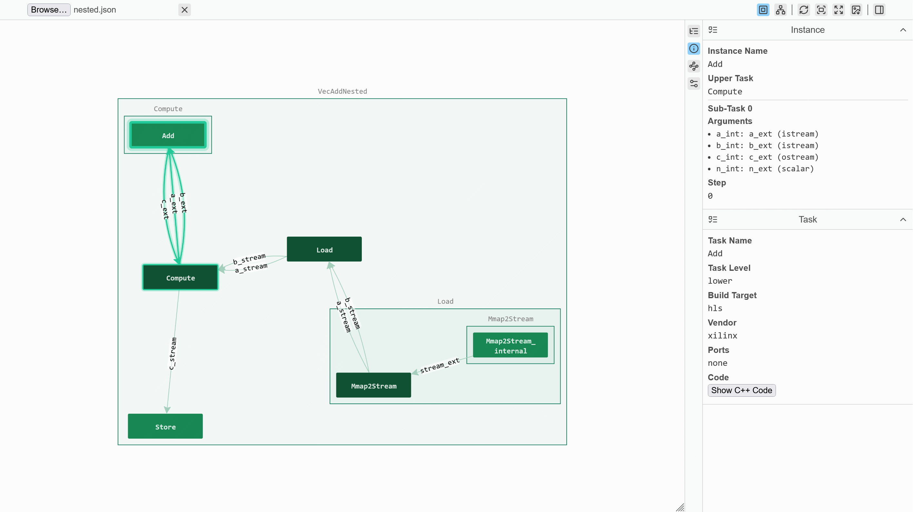

TAPA Visualizer
===============

TAPA Visualizer is a web-based tool for visualizing TAPA task structures.
It can render the ``graph.json`` file generated by the TAPA Compiler during
the compilation process. Allowing you to easily overview and inspect
your TAPA design.

Usage
-----

Select and open the ``graph.json`` file in the top-left file input.
The graph will load automatically after open.

Frequently used interactions are located in the top-bar. The main section
below top-bar are split into the graph area and the sidebar. Graph area
contains just the interactive graph. The sidebar has information for selected
item in graph, and options for the graph.

Top-bar
^^^^^^^

File input and Close File button are at the left side of the top-bar.
At the right side of it, there are task groupings and various actions.
Focus or hover the cursor on them to view their names in the tooltip.

First, there is a sub-task display toggle:

Merge sub-task
   A task can have multiple sub-tasks. When you select this option,
   There will be 1 node per task, all sub-tasks are merged into 1 node.

Separate Sub-task
   1 node per sub-task, nodes or edges for the same task are named as
   ``taskname/0``, ``taskname/1``... or ``connection/0``, ``connection/1``...

In either case, you can view the detailed sub-task information with
the Details sidebar which will be explained below under the Sidebar section.

Other icons are all functional buttons:

Rerender Graph
   Re-layout the graph, then fit view.
   Helpful for progressive layout algorithms like ForceAtlas2, when the graph
   is large and can't be layouted to a ideal shape in the first pass.

Fit Center
   Center the graph.

Fit View
   Center and resize the graph to the view.

Save Image
   Save the graph as image.

Toggle Sidebar
   Hide / show the sidebar.

Interactive Graph
^^^^^^^^^^^^^^^^^

The graph is rendered as a grouped directional graph. Tasks are shown
as nodes, connected by lines called edges, and contained under their
upper tasks, which are rectangle areas called combos.

Nodes are colored by their position in the graph, judged by their FIFO stream
connections. Read write / input output nodes are lighter, they only have
ingoing or outgoing connections. Other nodes are darker, they always have
both ingoing and outgoing connections.

Click on any item to show its information in Details sidebar, drag it to move
it around. Double-click a combo to expand or collapse it. Drag the background
(canvas) to move the graph, Shift & drag to do box selection, Ctrl & drag for
a lasso select.

You can switch layout algorithm, toggle expand upper tasks by default, and
show connection ports in the options sidebar.

Sidebar
^^^^^^^

The sidebar has several different tabbed sections. Click on the tab icon to
switch between them. Focus or hover the cursor on tab icon to view their
names in the tooltip.

Explorer sidebar
   Contains a list of all the tasks & sub-tasks in the graph.

Details sidebar
   Contains detail information on the selected item like task information.

Connections sidebar
   Contains connections and neighbors of the selected item.

Options sidebar
   Contains various less-used options for the graph.

Browser Support
---------------

TAPA Visualizer is highly compatible, but requires modern Web feature support
to render the interactive graph.

- Fully supported:
  - Chrome, Edge, or other Chromium-based browser;
  - Firefox or Firefox-based browser.
- Partially supported:
  - Safari and other WebKit-based browser should work,
  but they are not tested thoughly.
- Not supported:
  - browsers not updated for longer than 12 months.
  They are no longer safe for use, regardless of compatibility;
  - other browsers are not tested and might not work;
  - Internet Explorer and other outdated browsers won't be supported.
