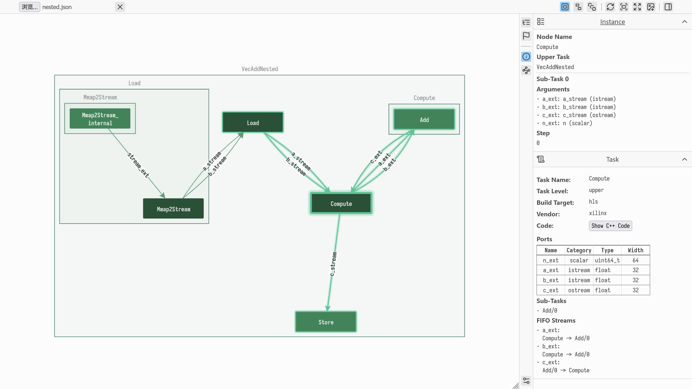
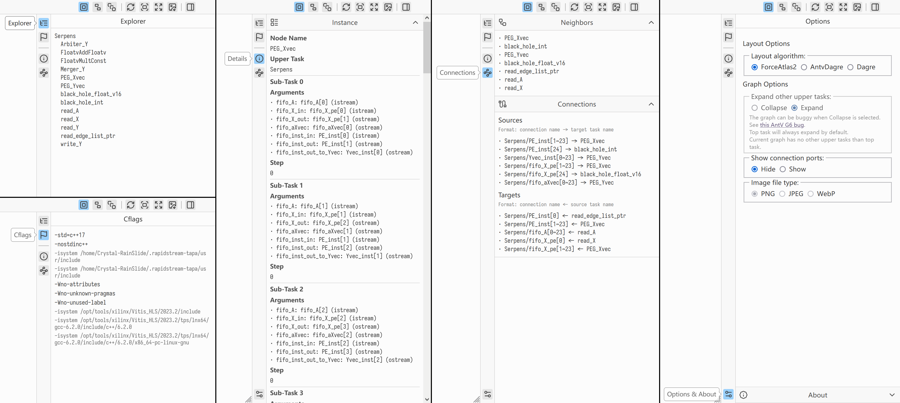

Visualizing TAPA Designs
========================

.. note::

   TAPA Visualizer is a web-based tool for visualizing and exploring
   TAPA task structures.
   `Access the most recent build here <https://gui.tapa.rapidstream.sh>`_.

TAPA Visualizer renders the ``graph.json`` file generated by the TAPA compiler
during compilation under the work directory, allowing you to easily overview
and understand your TAPA designs. This graphical representation helps identify
task relationships, data flows, and hierarchical structures.

Getting Started
---------------

To use the TAPA Visualizer, simply select and open a ``graph.json`` file using
the file input in the top-left corner of the interface. The graph will
automatically load and render after the file is selected.

The interface consists of three main components: the top toolbar with
frequently used controls, the interactive graph area in the center, and the
information sidebar on the right.

Interface Components
--------------------

Top Toolbar
~~~~~~~~~~~

The top toolbar contains controls for working with your graph:

**File Controls**:

- **Choose File** input for selecting a ``graph.json`` file.

- **Clear Graph** button to clear the current graph.

**Visualization Options**:

- Sub-task display toggle with three modes:

  - *Merge Sub-task*: Displays one node per task, merging all instances into
    a single node, even if a task has multiple sub-task instances.

  - *Separate Sub-task*: Shows one node per instance, with nodes named as
    ``taskname/0``, ``taskname/1``, and connections named as
    ``connection/0``, ``connection/1``, etc.

  - *Expand Sub-task*: Shows one node per actual sub-task, where every sub-task
    has their own sibling trees, instead of merged into a single tree like
    other sub-task display modes. The name scheme in Separate Sub-task works in
    Expand Sub-task too.

From left to right, Merge, Separate and Expand Sub-task are applied. Notice the
difference in the top-left *Load* combo, where ``Mmap2Stream`` has 2 sub-tasks.

**Action Buttons**:

- Rerender Graph: Re-layouts the graph and fits it to the view (useful for
  large graphs or when using progressive layout algorithms like ForceAtlas2).

- Fit Center: Centers the graph in the view.

- Fit View: Centers and resizes the graph to fit the current view.

- Save Image: Exports the current graph as an image file.

- Toggle Sidebar: Shows or hides the information sidebar.

.. tip::

   Hover over any button in the toolbar to see a tooltip with its name and
   function.

Interactive Graph
~~~~~~~~~~~~~~~~~

The graph represents your TAPA design as a hierarchical, directed graph:

- **Nodes** represent tasks and are colored according to their connectivity
  patterns. Nodes that only have incoming or outgoing connections (read/write
  or input/output nodes) are displayed in lighter colors, while nodes with
  both incoming and outgoing connections appear darker.
- **Edges** represent connections (typically FIFO streams) between tasks.
- **Combos** (rectangular areas) represent upper-level tasks containing
  nested tasks.

The graph supports several interactions:

- Click on any element to display its details in the sidebar.
- Drag nodes to reposition them.
- Double-click a combo to expand or collapse its contents.
- Drag the background to pan the view.
- Shift+drag to perform box selection.
- Ctrl+drag for lasso selection.

Sidebars
~~~~~~~~~~~~~~~~~~~

The sidebar provides detailed information about your TAPA design through
several tabs:

**Explorer Tab** presents a hierarchical list of all tasks and sub-tasks in
the graph, allowing you to quickly navigate complex designs.

**Cflags Tab** shows the cflags options passed to the compiler when building
this graph.

**Details Tab** shows comprehensive information about the currently selected
graph element, including task properties, parameters, and connectivity.

**Connections Tab** displays all connections and neighboring tasks for the
selected element, making it easy to trace data flows.

**Options Tab** contains additional visualization settings such as layout
algorithm selection, task expansion options, and connection port visibility.

Browser Compatibility
---------------------

TAPA Visualizer uses modern web technologies to provide an interactive
visualization experience. For optimal performance and functionality:

**Fully Supported Browsers** include Chrome, Edge, or other Chromium-based
browsers, and Firefox or Firefox-based browsers.

**Partially Supported Browsers** include Safari and other WebKit-based
browsers, which should work but have not been extensively tested.

**Unsupported Browsers** include browsers not updated within the past 12
months, such as Internet Explorer and other outdated browsers.

.. warning::

   Using a modern, updated browser is essential not only for compatibility
   with TAPA Visualizer but also for general web security.
